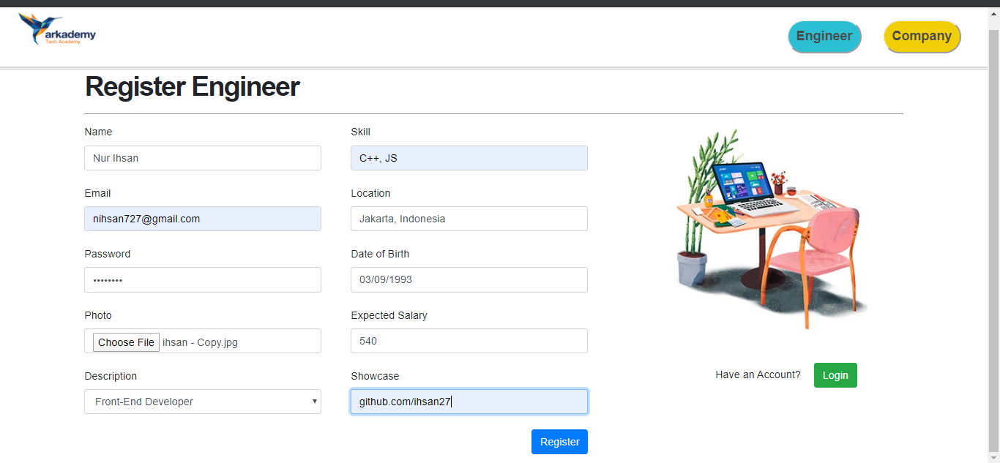
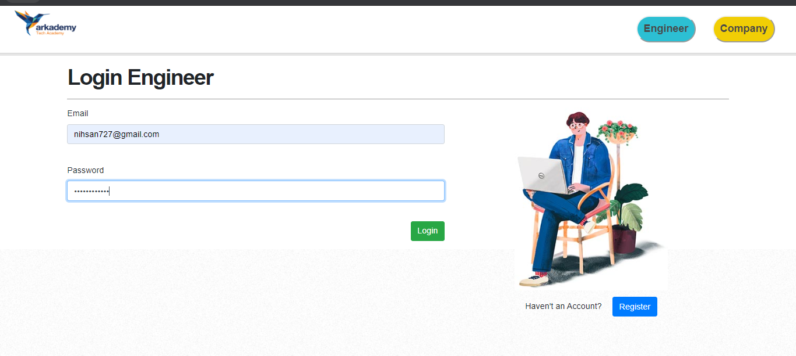
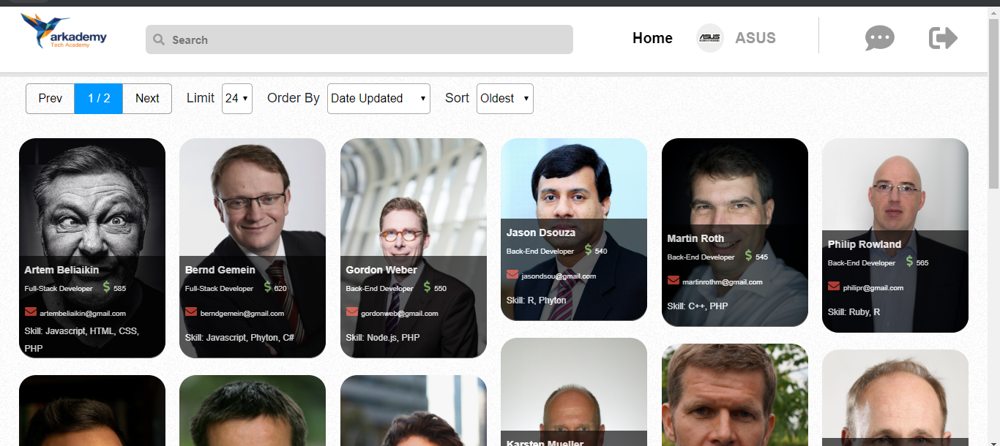
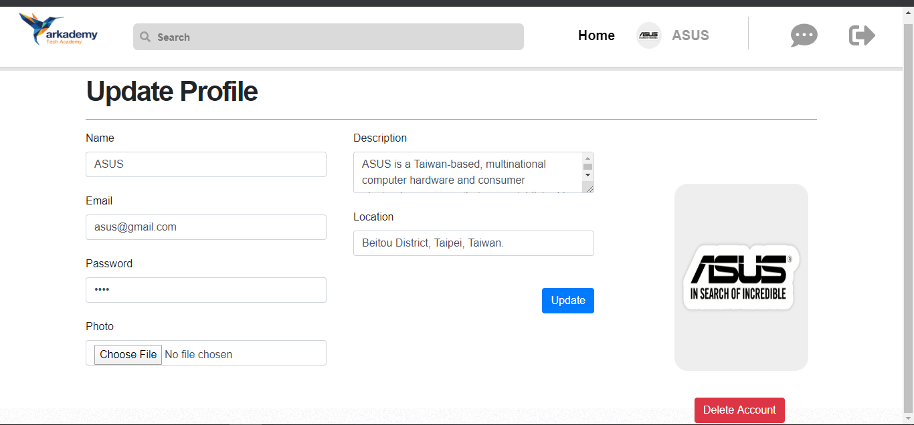
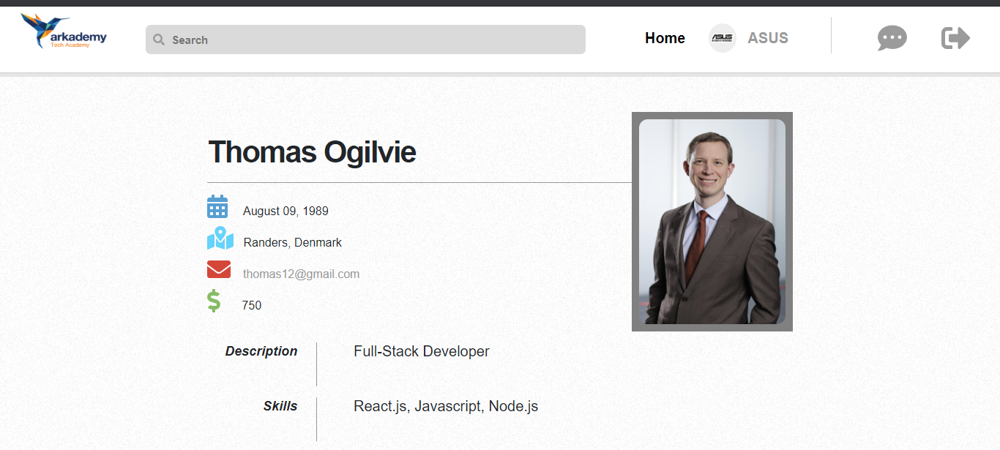

<h1 align="center">Hiring Channel App</h1>
<p align="center">
  
</p>
<p align="center">
  Built with React.js.
</p>

## Table of Contents

- [Introduction](#introduction)
- [Features](#features)
- [Requirements](#requirements)
- [Usage](#usage-for-development)
- [Create Environment Variable](#create-environment-variable)
- [Screenshots](#screenshots)
- [Related Project](#related-project-backend)
- [Contributors](#contributors)

## Introduction

<b>Hiring Channel App</b> is a website that can facilitate and connect between employers / companies and job seekers or engineers

## Features

- Users must sign up and sign in to use this application
- Employers/Companies can see list engineers
- Engineers can see list companies
- And others

## Requirements

- [`npm`](https://www.npmjs.com/get-npm)

## Usage for development

1. Open your terminal or command prompt
2. Type `git clone https://github.com/ihsan2/React-Hiring-Channel.git`
3. Open the folder and type `npm install` for install dependencies
4. Create Environment Variable [here](#create-environment-variable)
5. Before run this, you must run backend first
6. Type `npm start` for run this app.

## Create Environment Variable

```
$ cp .env.example .env
$ nano .env.development.local
$ nano .env.production.local
```

```
# Set API KEY
API_KEY_IMAGE=YOUR_HOST_IMAGE
API_KEY_URL=YOUR_HOST_URL
```

## Screenshots

<div align="center">
       
      
      
      
      
</div>

## Related Project (Backend)

- [`Backend RESTful API Hiring Channel App`](https://github.com/ihsan2/RESTful-API-Hiring-Channel-App.git)

## Contributors

<center>
  <table>
    <tr>
      <td align="center">
        <a href="https://github.com/ihsan2">
          <br/>
          <sub><b>Nur Ihsan</b></sub>
        </a>
      </td>
    </tr>
  </table>
</center>
